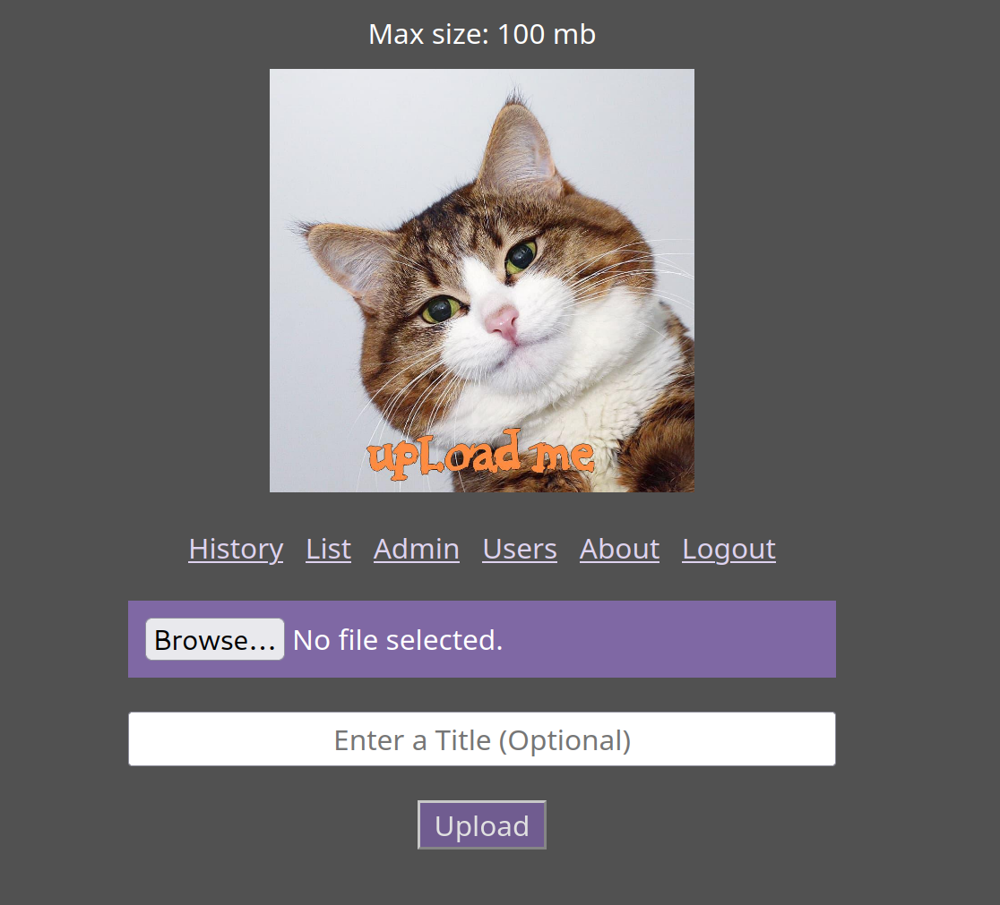
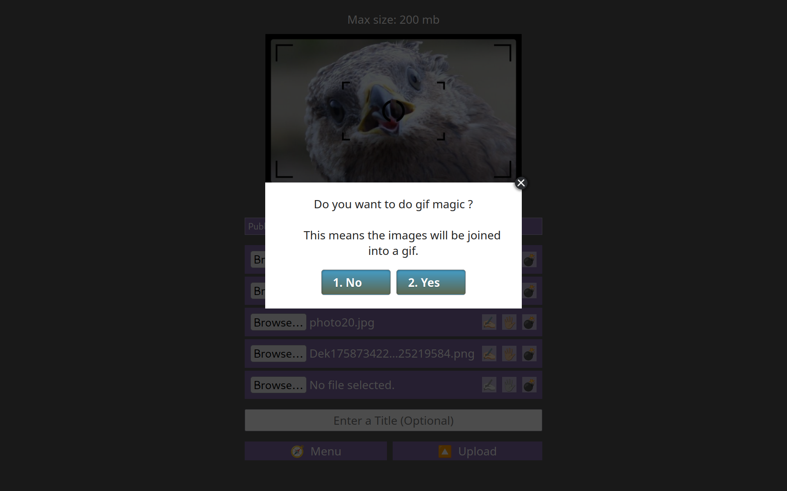

This is a simple file uploader that is configurable and has an admin page.

It's made entirely in python using flask.

It supports embedding media (images, videos, text/code/markdown, flash).

---

## Installation

Make a virtual env and install requirements.

Read [this](#config) to see how to configure it.

Run `venv/bin/python schema.py` to prepare the database.

Run `venv/bin/python add_admin.py` to add yourself as the first admin.

Run with gunicorn with this systemd service:

```
[Unit]
Description=Gunicorn instance to serve harambe
After=network.target

[Service]
User=someuser
Group=www-data
WorkingDirectory=/home/someuser/harambe/server
ExecStart=/home/someuser/harambe/server/venv/bin/python -m gunicorn -w 4 "app:app" --bind 0.0.0.0:4040 --timeout 600 --keep-alive 5 --error-logfile /home/me/error_harambe.log
TimeoutStopSec=3

[Install]
WantedBy=multi-user.target
```

In apache conf:

```
ProxyPreserveHost On
ProxyPass / http://localhost:4040/ timeout=600 Keepalive=On retry=1 acquire=3000
ProxyPassReverse / http://localhost:4040/
LimitRequestBody 522144000
```

---

## Config <a name="config"></a>

Configs are set in `server/config.toml` which you must create.

You can check the default values in [config.py](server/config.py) and redefine what you need.

The `toml` format looks like:

```toml
files_dir = "/mnt/drive/harambe"

uppercase_ids = false

post_reaction_limit = 250
```

The config file is automatically reloaded when the file is modified.

This is done by using the `watchdog` library.

So there's no need to restart the server on config changes.

There are some exceptions like `app_key` which can't be changed at runtime.

---

## Admin

There are admin pages to view and delete files and users.

Admins can create more users, but you need to create the first admin.

You can do it with `venv/bin/python add_admin.py`.

---

## Users

Users can be added by admins in the admin page.

`username` is the main id of the user, it can't change.

`password` password used to authenticate.

`name` is the public name to be displayed in posts.

If `name` is empty, no name will be displayed.

`admin` defines if a user has admin rights or not.

`rpm` the amount of requests per minute it can do.

`max_size` is the max file size permitted to that user.

If `max_size` is set to 0, it will use the default max file size config.

If `reader` is true, the user can view the file list page.

If `lister` is true, the users's post get to be listed.

If `reacter` is true, the users can react to posts.

If `mage` is true, the user can perform magic actions.

`mark` is a string that is appended to urls on uploads from that user.

For example: `site.com/01jkxsxp4k_wlk` instead of `site.com/01jkxsxp4k`.

It could be useful to keep track of who uploaded who based on urls and file names.

If empty, it won't use a mark.

---

## Links

Links can be shown in the main page if you create them in the config:

```toml
[[links]]
name = "About"
url = "/page/about"

[[links]]
name = "Recipes"
url = "/page/recipes"
target = "_blank"
```

`target` is optional. `_blank` means to open them in a new tab.

---

## Assets

There is a directory called `assets` inside `static`.

This directoy is not version controlled so you can add anything you want.

You can use this to host html pages which you can link in the main page.

Just make sure to not delete the `.gitignore` file that is inside.

---

## Database

There is an `sqlite3` database that holds some data about the files.

This includes the creation date, the title, and views.

This is located in `server/database.sqlite3`.

To create and update the database run `schema.py`.

---

## Script

There is [this script](upload.rb) which you can use to upload if you are a user.

Just change `url`, `username`, and `password`, and you might also need to change `endpoint`.

Optional flag `--prompt` triggers a `zenity` prompt for the title.

Optional flag `--zip` makes a zip file on the server.

Optional flag `--private` will make an unlisted post.

Optional flag `--image-magic` to perform image magic if possible.

Optional flag `--audio-magic` to perform audio magic if possible.

Optional flag `--album-magic` to perform album magic if possible.

---

## Zip Archives

Multiple files can be uploaded at the same time.

When multiple files are uploaded, a zip archive is created as the file.

As each post contains only one file.

The web interface makes it easy to pick multiple files quickly.

---

## Menus and Keyboard

There is a main menu to navigate to most locations.

Menu buttons can be triggered with numbers on the keyboard.

For example 1 will trigger the first button.

There are some global shortcuts:

`Ctrl+m`: Show the main menu.

`Ctrl+Up`: Go to the fresh post.

`Ctrl+Right`: Go to the next post.

`Ctrl+Shift+Right`: Go to a random post.

`Ctrl+Shift+Up`: Edit a post.

`Ctrl+Down`: React to a post.

---

## Samples

Samples are used to quickly check what a post is about in lists like `/list/posts`.

When a video is uploaded, 1 frame is extracted as the the sample.

If it's an image, a lite version is used as the sample.

If it's an audio file, a 10 second clip is created as the sample.

If it's a text file, a portion of the file is created as the sample.

If it's a zip archive, a text file with its file names is created as the sample.

There are various configurations for sample creation.

When a sample icon is clicked, it shows a popup window in the top right.

It supports moving to prev or next samples using arrow buttons, or keyboard arrows.

It has a title with the file name, which when clicked opens the post.

---

## Magic

Harambe knows some magic spells that convert or create files.

To use these, a user must have the `mage` permission.

On the web interface, if the file combination matches, the user is asked if they want to apply the magic action, which is basically `ffmpeg` and it can take a long time to complete, unless you have nice `gpu` support for it.



The current spells are:

## Image Magic

Convert images to `jpg`.

Triggers when a single image is going to be uploaded.

Ignores `jpg` and `gif`.

## Audio Magic

Convert audio to `mp3`.

Triggers when a single audio is going to be uploaded.

Ignores `mp3`.

## Album Magic

Join an image with one or more audio files.

Triggers when a single image and 1 or more audio files are going to be uploaded.

Also triggers when multiple audio files are uploaded, without an image.

It creates an `mp4` video.

## Gif Magic

Join multiple images into a `gif`.

Triggers when multiple images are going to be uploaded.

Ignores `gif`.
