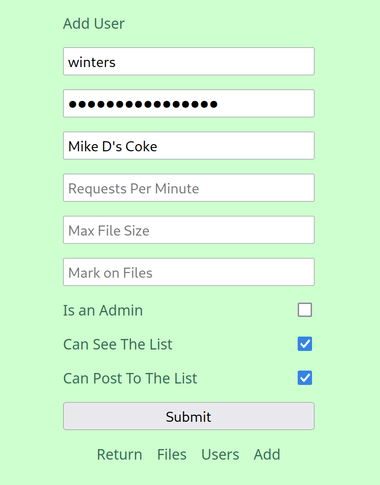
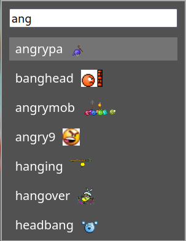

This is a simple file uploader that is configurable and has an admin page.

It's made entirely in python using flask.

---

## Installation

Make a virtual env and install requirements.

Read [this](#config) to see how to configure it.

Run `venv/bin/python schema.py` to prepare the database.

Run `venv/bin/python add_admin.py` to add yourself as the first admin.

Run with gunicorn with this systemd service:

```
[Unit]
Description=Gunicorn instance to serve harambe
After=network.target

[Service]
User=someuser
Group=www-data
WorkingDirectory=/home/someuser/harambe/server
ExecStart=/home/someuser/harambe/server/venv/bin/python -m gunicorn -w 4 "app:app" --bind 0.0.0.0:4040
TimeoutStopSec=3

[Install]
WantedBy=multi-user.target
```

In apache conf:

```
ProxyPreserveHost On
ProxyPass / http://localhost:4040/
ProxyPassReverse / http://localhost:4040/
```

---

## Config <a name="config"></a>

Configs are set in `server/config.toml` which you must create.

You can check the default values in [config.py](server/config.py) and redefine what you need.

The `toml` format looks as followed:

For example:

```toml
files_dir = "/mnt/drive/harambe"

uppercase_ids = false
```

The config file is automatically reloaded when the file is modified.

This is done by using the `watchdog` library.

So there's no need to restart the server on config changes.

There are some exceptions like `app_key` which can't be changed at runtime.

---

## Admin

There are admin pages to view and delete files and users.

Admins can create more users, but you need to create the first admin.

You can do it with `venv/bin/python add_admin.py`.

---

## Users

Users can be added by admins in the admin page.

`username` is the main id of the user, it can't change.

`password` password used to authenticate.

`name` is the public name to be displayed in posts.

If `name` is empty, no name will be displayed.

`admin` defines if a user has admin rights or not.

`rpm` the amount of requests per minute it can do.

`max_size` is the max file size permitted to that user.

If `max_size` is set to 0 it will use the default max file size config.

If `can_list` is true the user can view the file list page.

`mark` is a string that is appended to urls on uploads from that user.

For example: `site.com/01jkxsxp4k_wlk` instead of `site.com/01jkxsxp4k`.

It could be useful to keep track of who uploaded who based on urls and file names.

If empty, it won't use a mark.



---

## Style

The main image at the top can be replaced by creating a file in `server/static/img`.

This file is called `banner` and it can be `jpg`, `png`, or `gif`.

It's also possible to change the `background_color` and `font_family`.

As well as `accent_color`, `font_color`, `text_color`, and `link_color`.

---

## List

A file index page can be enabled with `list_enabled`.

This will allow anybody to view the list of uploaded files.

This is turned off by default.

The list can be set to private which requires users to use their key to view.

For example: `site.com/list?key=secretUserKey`

---

## Links

Links can be show in the main page if you create them in the config:

```toml
[[links]]
name = "About"
url = "/page/about"

[[links]]
name = "Recipes"
url = "/page/recipes"
target = "_blank"
```

`target` is optional. `_blank` means to open them in a new tab.

---

## Assets

There is a directory called `assets` inside `static`.

This directoy is not version controlled so you can add anything you want.

You can use this to host html pages which you can link in the main page.

Just make sure to not delete the `.gitignore` file that is inside.

---

## Database

There is an `sqlite3` database that holds some data about the files.

This includes the creation date, the title, and views.

This is located in `server/database.sqlite3`.

To create and update the database run `schema.py`.

## Script

There is [this script](upload.sh) which you can use to upload if you are a user.

Just change `URL`, `USERNAME`, and `PASSWORD`.

The arguments are a file path, and an optional mode argument which you can set to `title`.

If you set that second argument to `title` it will use `zenity` to prompt for a title.

## Reactions

Users can react with icons or with short words:


