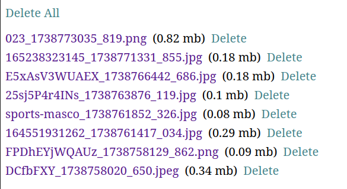
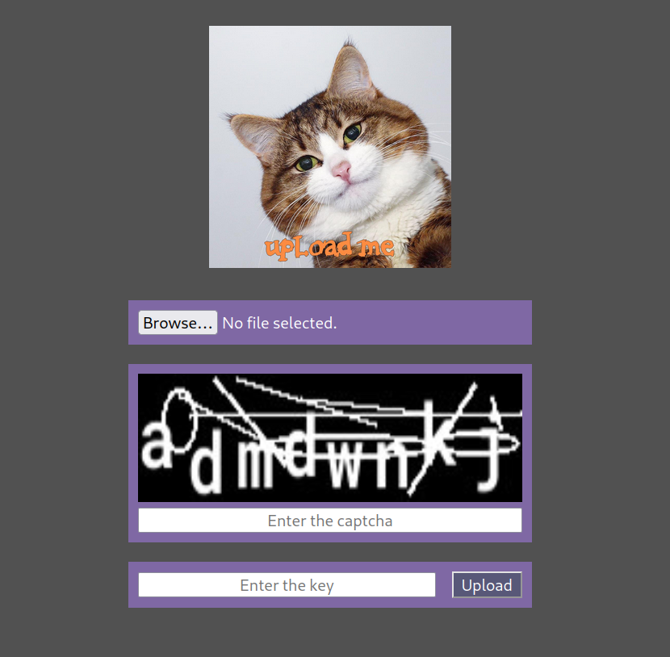

This is a simple file uploader that is configurable and has an admin page.

It's made entirely in python using flask.

---

## Installation

Make a virtual env and install requirements.

Read [this](#config) to see how to configure it.

Run with gunicorn with this systemd service:

```
[Unit]
Description=Gunicorn instance to serve harambe
After=network.target

[Service]
User=someuser
Group=www-data
WorkingDirectory=/home/someuser/harambe/server
ExecStart=/home/someuser/harambe/server/venv/bin/python -m gunicorn -w 4 "app:app" --bind 0.0.0.0:4040
TimeoutStopSec=3

[Install]
WantedBy=multi-user.target
```

In apache conf:

```
ProxyPreserveHost On
ProxyPass / http://localhost:4040/
ProxyPassReverse / http://localhost:4040/
```

---

## Admin

There is an admin page to view and delete files:



---

## Keys

You can add keys to the `keys` array in the config.

These give access to users to upload directly from the command line.

And it might be necesary to supply one in the web interface if `require_key` is enabled.

This is how it looks when a key is needed for the web interface:



---

This is how it looks when neither captcha or key are required:


---

## Config <a name="config"></a>

Configs are set in `server/config.toml` which you must create.

You can check the default values in [config.py](server/config.py) and redefine what you need.

The config file is automatically reloaded when the file is modified.

This is done by using the `watchdog` library.

So there's no need to restart the server on config changes.

There are some exceptions like `app_key` which can't be changed at runtime.